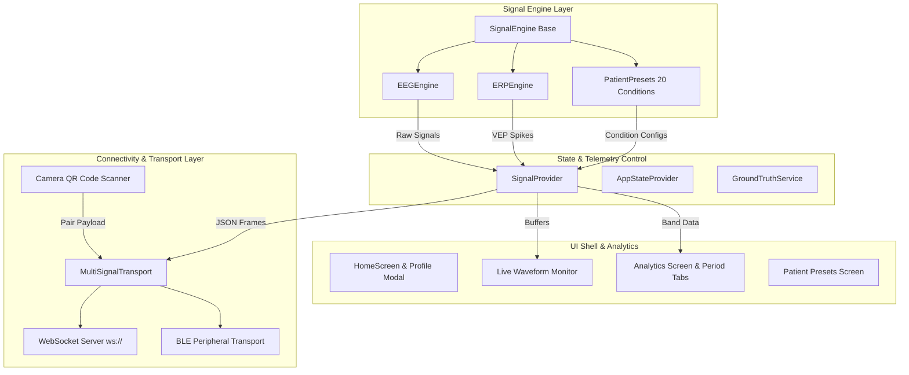

<div align="center">

# ⚡ POKIDEX
### High-Performance Neural Telemetry, Signal Synthesis & BCI Connectivity Platform
#### Official Hardware & Pipeline Integration Companion for Pyromatix & NeuroSync Systems

[](https://flutter.dev)
[](https://dart.dev)
[](https://flutter.dev)
[](https://opensource.org/licenses/MIT)

**POKIDEX** is a next-generation biomedical research platform designed specifically for real-time biopotential signal generation, instant QR code hardware connectivity, multi-channel EEG/ERP telemetry streaming, and clinical patient condition simulations. Built to seamlessly integrate with **Pyromatix** and **NeuroSync** BCI pipelines.

[Explore Features](#-key-features) • [Instant QR Pairing](#-instant-qr-code-connectivity) • [Patient Condition Presets](#-20-clinical-patient-condition-presets) • [Architecture](#-system-architecture) • [Getting Started](#-getting-started)

</div>

---

## 📖 Table of Contents
- [Detailed System Description](#-detailed-system-description)
- [Overview & Purpose](#-overview--purpose)
- [Key Features](#-key-features)
- [Instant QR Code Connectivity](#-instant-qr-code-connectivity)
- [20 Clinical Patient Condition Presets](#-20-clinical-patient-condition-presets)
- [System Architecture](#-system-architecture)
- [Module Breakdown](#-module-breakdown)
  - [1. Real-Time Signal Generators](#1-real-time-signal-generators)
  - [2. Telemetry Transport & QR Pairing](#2-telemetry-transport--qr-pairing)
  - [3. Deep Analytics & Spectral Power Density](#3-deep-analytics--spectral-power-density)
  - [4. Ground-Truth Event Logging](#4-ground-truth-event-logging)
- [Getting Started](#-getting-started)
- [Tech Stack & Dependencies](#-tech-stack--dependencies)
- [Contributing & License](#-license)

---

## 🔬 Detailed System Description

**POKIDEX** (Biomedical Signal Synthesizer & Telemetry Terminal) is an advanced, cross-platform software ecosystem engineered to solve a fundamental challenge in Brain-Computer Interface (BCI) research: **testing, calibrating, and validating real-time neural decoding pipelines without requiring continuous human subjects or physical hardware electrodes**.

### 🎯 What Pokidex Accomplishes
In modern neuroscience and BCI development, software pipelines like **Pyromatix** (signal processing, filtering, and machine learning feature extraction) and **NeuroSync** (real-time neural feedback & stimulus presentation) require continuous streams of high-frequency bio-potential data. POKIDEX serves as an intelligent, controllable bio-signal generator and acquisition node that broadcasts mathematically authentic multi-channel electroencephalogram (EEG) and visual evoked potential (ERP/VEP) data streams.

### 🧠 Core Capabilities & Scientific Precision
1. **Mathematical Waveform Synthesis**:
   - **Full Frequency Band Control**: Synthesizes continuous multi-frequency rhythms across **Delta (0.5–4 Hz)**, **Theta (4–8 Hz)**, **Alpha (8–12 Hz)**, **Beta (12–30 Hz)**, and **Gamma (30–100+ Hz)** bands.
   - **Realistic Biological Artifacts**: Blends pink $1/f$ background noise, muscle EMG jitter, ocular blink artifacts, and powerline 50/60 Hz hum to replicate authentic clinical environments.
   - **Stimulus-Locked Evoked Potentials**: Generates precise event-related potentials including **N75, P100, and N145** visual responses with adjustable latency jitter for trial-averaged ERP validation.

2. **20 Clinical Neurological Condition Presets**:
   - Includes 20 pre-configured physiological profiles ranging from **Epileptic Absence Spikes** (3 Hz spike-and-wave discharges), **ADHD Focus Deficits** (high Theta/Beta ratios), **Alzheimer's Diffuse Slowing**, **Sleep Stages (N3 Slow-Wave & REM)**, to **Propofol Anesthesia Burst Suppression**.
   - Each preset features a single-line cyber card design with a real-time waveform preview graph.

3. **Camera-Based Instant QR Code Connectivity**:
   - Eliminates manual IP configuration and Bluetooth discovery delays.
   - Users scan the QR code displayed on the **Pyromatix** or **NeuroSync** terminal using the built-in live camera viewfinder (`mobile_scanner`).
   - Pokidex instantly parses the pairing payload, initializes embedded TCP WebSockets (`shelf_web_socket`), and activates real-time signal transmission, data acquisition, and spectral breakdown.

4. **Biomedical Analytics & Ground-Truth Event Logging**:
   - **Spectral Power Density (SPD)**: Computes dynamic frequency power distribution with period switching (`DAY`, `WEEK`, `MONTH`).
   - **Ground-Truth CSV/JSON Recorder**: Records millisecond-accurate timestamped event triggers alongside raw bio-potential samples, allowing BCI researchers to evaluate machine learning classification accuracy against known baseline ground truth.

---

## 🌟 Overview & Purpose

**POKIDEX** bridges the gap between synthetic neural signal generation and live biomedical execution pipelines like **Pyromatix** and **NeuroSync**. Whether simulating pathological brain states for machine learning validation or streaming live multi-channel EEG/VEP telemetry across local sockets, POKIDEX offers a sleek, high-precision environment for researchers, BCI engineers, and neuroscientists.

With zero startup lag, instant camera-based QR pairing, and 20 calibrated clinical patient condition presets, POKIDEX eliminates manual configuration and delivers instant signal acquisition and analysis.

---

## ✨ Key Features

- 📷 **Camera QR Code Connectivity**: Instant pairing with Pyromatix and NeuroSync terminals via live camera QR code scanning (`mobile_scanner`).
- 🧠 **20 Clinical Patient Presets**: Pre-calibrated physiological conditions (Epilepsy, ADHD, Alzheimer's, Sleep N3/REM, Parkinson's, Schizophrenia, TBI, Propofol Anesthesia, etc.) with live waveform preview graphs.
- ⚡ **Multi-Engine Signal Synthesis**: Real-time generation of multi-channel EEG (Alpha, Beta, Theta, Delta, Gamma) and ERP/VEP (Event-Related Potentials: N75, P100, N145) with custom noise and artifact controls.
- 📡 **Dual Transport Broadcast**: Embedded low-latency WebSocket TCP server (`shelf_web_socket`) and BLE Peripheral simulation for real-time packet delivery.
- 📊 **Dynamic Analytics & Spectral Power Density**: Interactive period switching (DAY | WEEK | MONTH) with dynamic line graphs, key performance metrics, and clickable session history logs.
- 👤 **Interactive User Profile & System Status**: Tap profile avatar to inspect active BCI node settings, telemetry channels, and active node status.

---

## 📷 Instant QR Code Connectivity

Instead of manual IP entry or lengthy device searches, POKIDEX features an instant **Camera QR Code Connectivity Scanner**:

1. Tap the **Settings / Connection** tab or notification bar.
2. Direct your phone camera at the QR code displayed on your **Pyromatix** or **NeuroSync** BCI screen.
3. The camera instantly reads the pairing payload, establishes local transport sockets, and begins live signal transmission and acquisition automatically.

```text
[Pyromatix / NeuroSync Screen] ---> (Displays QR Code) 
                                           │
                                           ▼ (Camera Scanned via Pokidex)
[Pokidex Mobile App] ---------> (Establishes Transport & Starts Stream)
```

---

## 🩺 20 Clinical Patient Condition Presets

POKIDEX includes 20 pre-configured clinical neurological and physiological presets, designed into sleek, high-contrast single-line cards with real-time waveform pattern previews:

| Category | Condition Preset | Clinical Signature / Waveform Characteristics |
| :--- | :--- | :--- |
| **Epilepsy** | General Seizure / Absence Spikes | 3 Hz spike-and-wave bursts & hypersynchronous discharges |
| **Attention** | ADHD / Focus Deficit Pattern | Elevated Theta/Beta ratio (> 4.5) with low Alpha power |
| **Cognitive** | Alzheimer's Disease / Mild Impairment | Diffuse slowing, reduced Alpha peak frequency (6-7 Hz) |
| **Sleep** | Deep Sleep (N3 Stage / Delta Waves) | High-amplitude slow Delta waves (0.5-2.0 Hz, > 75 µV) |
| **Sleep** | REM Sleep / Vivid Dreaming State | Low-voltage mixed frequency with sawtooth theta waves |
| **Mood** | Major Depressive Disorder (MDD) | Alpha power asymmetry (left frontal alpha hypoactivity) |
| **Mood** | Generalized Anxiety / Stress Pattern | High-frequency Beta hyperactivity (20-30 Hz) |
| **Motor** | Parkinson's Disease / Resting Tremor | 4-6 Hz sensorimotor rhythm oscillation & beta desynchronization |
| **Trauma** | Traumatic Brain Injury (TBI) | Focal slow-wave delta activity near lesion site |
| **Vascular** | Post-Stroke Slowing | Lateralized delta/theta slowing in affected hemisphere |
| **Psychiatric** | Schizophrenia / Gamma Deficit | Reduced auditory 40 Hz gamma phase-locking response |
| **Stress** | Chronic Burnout / Exhaustion | Low total power, suppressed alpha peak & high fatigue theta |
| **Anesthesia** | Propofol Deep Sedation | Frontal alpha-delta burst suppression pattern |
| **Neuro** | Migraine Aura Phase | Cortical spreading depression slow wave shift |
| **Sleep** | Insomnia / Hyperarousal | Elevated fast beta/gamma power during rest attempts |
| **Metabolic** | Hepatic Encephalopathy | Triphasic slow waves (1.5-3.0 Hz) |
| **Movement** | Essential Tremor Signal | 8-12 Hz central motor cortex oscillations |
| **Control** | Healthy Adult Baseline Rest | Dominant 10 Hz occipital posterior alpha rhythm |
| **VEP** | High-Frequency Visual Evoked Potential | Sharp 100 ms latency P100 peak upon visual flash |
| **Cognitive** | High Mental Workload / N-Back Task | Frontal midline theta (FMT) enhancement & parietal alpha attenuation |

---

## 🏗️ System Architecture



---

## 🔍 Module Breakdown

### 1. Real-Time Signal Generators
- **EEG Engine** (`lib/engines/eeg_engine.dart`): Synthesizes multi-channel brainwave rhythms with adjustable frequency, amplitude, pink noise, and muscle artifacts.
- **ERP / VEP Engine** (`lib/engines/erp_engine.dart`): Simulates visual evoked potentials (N75, P100, N145) with latency jitter controls.
- **Patient Presets** (`lib/models/patient_preset.dart`): Contains 20 clinical conditions ready for instant one-tap deployment.

### 2. Telemetry Transport & QR Pairing
- **QR Scanner View** (`lib/screens/connection_screen.dart`): Real-time camera viewfinder that scans pairing codes, connects to local nodes, and starts telemetry broadcast.
- **WebSocket Transport** (`lib/transport/websocket_transport.dart`): Embedded TCP server streaming JSON signal frames.

### 3. Deep Analytics & Spectral Power Density
- **Analytics View** (`lib/screens/analytics_screen.dart`): Features period switching (DAY | WEEK | MONTH) that updates spectral power density charts, average power figures, change trends, and interactive session logs.

### 4. Ground-Truth Event Logging
- **Ground Truth Service** (`lib/services/ground_truth_service.dart`): Timestamped trigger index recorder for classifier validation and dataset export.

---

## 🚀 Getting Started

### Prerequisites
- **[Flutter SDK](https://docs.flutter.dev/get-started/install)** (Version >= 3.3.0)
- **[Dart SDK](https://dart.dev/get-dart)** (Version >= 3.3.0 < 4.0.0)
- Android physical device or emulator with camera support.

### Quick Start

1. **Clone Repository**:
   ```bash
   git clone https://github.com/Barathwaj2006/Pokidex.git
   cd Pokidex
   ```

2. **Install Dependencies**:
   ```bash
   flutter pub get
   ```

3. **Build & Run**:
   ```bash
   flutter run
   ```

4. **Build Android Release APK**:
   ```bash
   flutter build apk --release
   ```
   *Compiled APK output path*: `build/app/outputs/flutter-apk/app-release.apk`

---

## 🛠️ Tech Stack & Dependencies

| Package | Purpose |
| :--- | :--- |
| **flutter** | Multi-platform mobile/desktop UI framework |
| **mobile_scanner** | Native camera QR code scanner for instant pairing |
| **provider** | Reactive state management layer |
| **fl_chart** | Dynamic real-time biopotential & spectral power graphing |
| **shelf & shelf_web_socket** | Embedded TCP WebSocket telemetry server |
| **flutter_launcher_icons** | Automated 3D app icon generation |
| **google_fonts** | Cyberpunk & medical typography system |

---

## 📜 License

Distributed under the **MIT License**. See `LICENSE` for details.

<div align="center">
  <sub>Designed & Developed by <a href="https://github.com/Barathwaj2006">Barathwaj</a> for Pyromatix & NeuroSync BCI Systems.</sub>
</div>